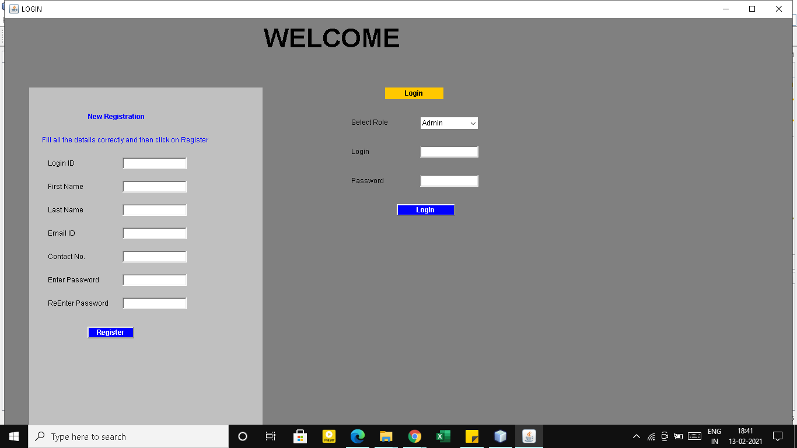
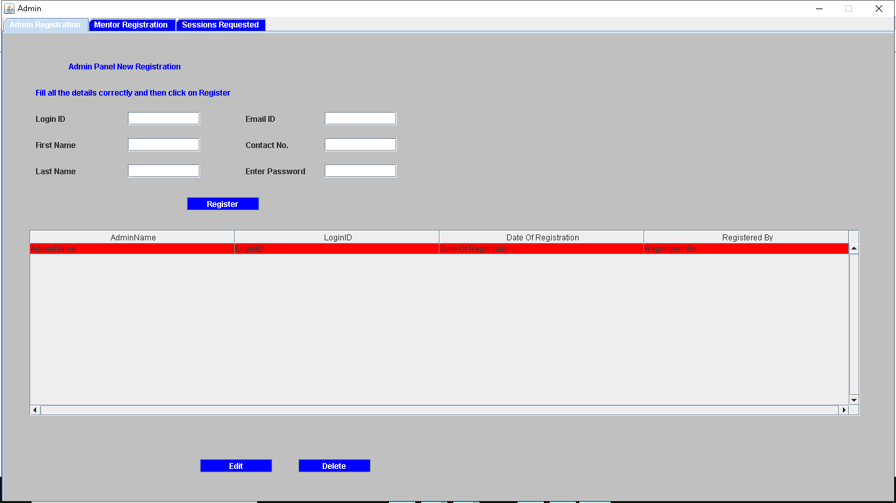
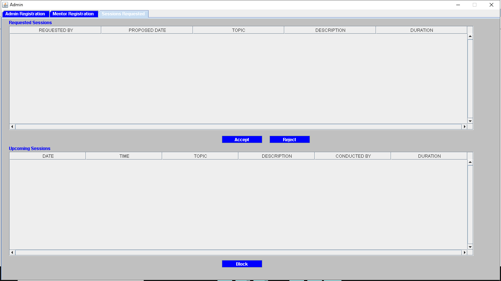
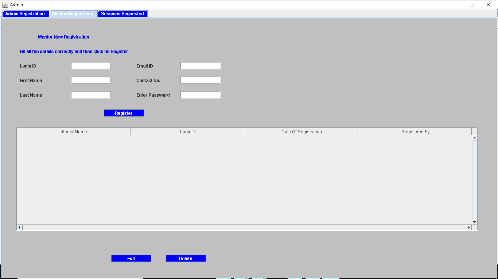
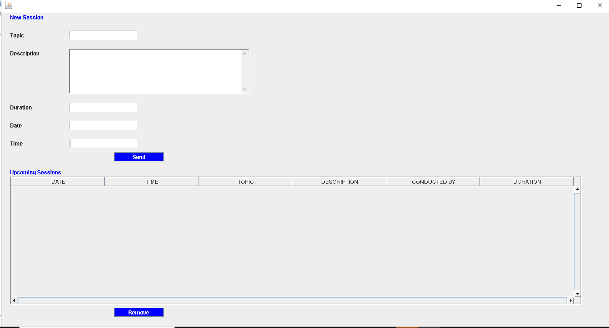

# Edu-Chat-Room
It was my starting project in 2nd year of Bachelors. This project was aimed to create an environment for providing mentoring live sessions to students at colleges over LAN network. It is designed using concepts of core java programming includes OOPs, multithreading, AWT, Swing, JDBC and networking. It have three kinds of users Admin, Mentors and Students.

Admin: 
* View login details of students and mentors
* Register new admin, mentors, students and sessions.
* Manage all sessions, database and other admin activities.

Student:
* Register and Login 
* Students can check all the sessions.
* They can join live sessions and ask doubts on it.

Mentor:
* Register and Login 
* Create a session
* Conduct a live session

# Project Details
Technology used includes Java, JDBC, MySQL and Apache Server.
1. ForumClient - It contains the client side of the application.
2. ForumServer - It contains the server side of the application.
3. discussforumdb.sql - It contains the database for the application.

# Installation
* It is pretty simple to install just download the files from github.
* Run server files using JDBC and Apache server. 
* If needed change the root username and password for JDBC connection to MySQL server in ForumServer/src/serverres/ConnectionFactory.java .
* Then you can download and run the client files.
* Create the users as per needed, conduct sessions and enjoy.

## Some images from the project are shown below

